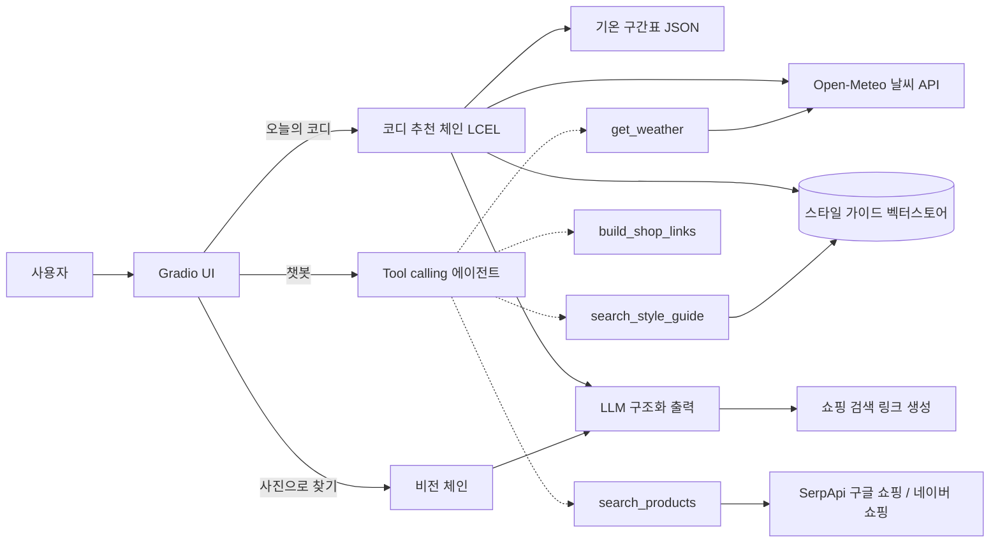

<!-- 위 블록은 Hugging Face Spaces 배포 설정이에요. GitHub에서는 표로 보이는데 지우면 배포가 깨져요. -->

# 🌤️ Fitcast — 옷차림 예보

> 일기예보는 봤는데, 뭘 입을지는 모르겠다면.
> **오늘 날씨와 내 스타일에 딱 맞는 코디를 예보해주는 AI 옷차림 에이전트**

날씨를 조회하고, 사용자의 선호 스타일과 TPO를 반영해 상의·하의·외투·신발·악세사리를 한 세트로 추천한 뒤, 무신사·29CM·지그재그·에이블리·테무·쉬인에서 바로 찾아볼 수 있는 검색 링크까지 붙여주는 LangChain 미니 프로젝트예요.

## 목차

1. [주요 기능](#주요-기능)
2. [LangChain 적용 지점 7가지](#langchain-적용-지점-7가지)
3. [아키텍처](#아키텍처)
4. [폴더 구조](#폴더-구조)
5. [시작하기](#시작하기)
6. [환경변수](#환경변수)
7. [개발 규칙](#개발-규칙)
8. [확장 가이드](#확장-가이드)
9. [구현 체크리스트](#구현-체크리스트)
10. [배포 (Hugging Face Spaces)](#배포-hugging-face-spaces)
11. [트러블슈팅](#트러블슈팅)
12. [한계와 주의사항](#한계와-주의사항)

## 주요 기능

### 메인 웹 (`/`) — 아바타 피팅룸

| 화면 | 설명 |
|---|---|
| 랜딩 | 매거진 룩북 스타일의 소개 페이지. 룩북 사진(`web/img/fit1~7.jpg`)을 카드 비율에 맞춰 잘라 넣고, 얼굴상 카드는 얼굴 원본 사진(`avatar_kit/dist/photos`)을 눈 위치·머리 폭 기준의 같은 구도로 잘라 보여줘요. 온보딩의 얼굴·헤어 고르기도 같은 사진에 헤어 누끼를 올려 미리 보여줘요(`photoHead`, 인라인 SVG) |
| 아바타 만들기 (4단계) | ① 체형(모래시계·삼각·역삼각·일자·사과·탄탄한 체형 + 성별·피부톤) ② 옷 스타일 48종 중 최대 5개 ③ 얼굴 & 헤어 — 왼쪽 얼굴 분위기(강아지·고양이·햄스터·토끼·여우·사슴) · 가운데 큰 미리보기 · 오른쪽 헤어 7종 + 컬러를 한 화면에서 ④ 키·몸무게. 고를 때마다 오른쪽 아바타가 바로 바뀌어요. 여성은 `avatar_kit` 실사풍 에셋으로 그리고, **남성은 에셋이 준비되지 않아 '개발 중'으로 막아뒀어요** (`GENDERS`의 `soon`). 몸무게는 실루엣에 아주 조금만 반영돼 원본 에셋 비율이 유지돼요 |
| 피팅룸 | 옷장에서 아이템을 골라 룩북에 담는 화면. 옷장의 아이템은 **실제 판매 상품의 누끼 사진**이에요 (`tools/build_catalog.py`가 구글 쇼핑에서 찾아 배경을 지운 사진 + 판매처·상품명·가격·링크, 남성·아동 상품은 제외). 가운데 아바타는 옷을 입히지 않은 기본 모습이고, 실제 착용 모습은 **AI 피팅 보기**로 생성해요. 왼쪽 패널에는 담은 상품이 매거진처럼 배치되고, 아래 **Shop the look** 카드에 사진·판매처·가격·구매 링크가 정리돼요 |
| AI 날씨 코디 | 도시·날짜·TPO를 넣으면 체형·스타일을 반영한 코디를 추천받아 아바타에 바로 입혀요. 추천이 뜨면 LLM이 뽑은 아이템별 키워드로 화면이 실제 상품을 이어서 검색하고(`POST /api/recommend` → `GET /api/products?cut=1`), 서버가 후보 사진 중 **사람 없이 상품만 찍힌 사진**을 비전 모델로 골라 누끼를 떠서 룩북에 보여주고, 아바타에는 그 사진의 대표색으로 체형에 맞춘 옷을 입혀요 |
| AI 피팅 보기 (실험) | 아바타와 실제 상품 이미지, 온보딩에서 적은 키·몸무게·체형·헤어를 이미지 편집 모델(`FITCAST_IMAGE_MODEL`)에 보내 입힌 모습을 생성해요 (`POST /api/tryon`). 별도 버튼이라 느리거나 실패해도 코디 추천은 그대로 동작해요. 같은 입력의 결과는 `data/tryon_cache/`에 저장돼 다시 누르면 바로 나와요 (시연용 결과를 미리 뽑아두세요) |

| 회원 · 저장 코디 | 이메일·비밀번호로 가입하면 아바타 프로필이 계정에 저장되고, AI 피팅 결과와 함께 마음에 드는 코디를 저장해 **MY · 저장 코디** 탭에서 다시 입어볼 수 있어요 (`/api/auth/*`, `/api/looks`, SQLite `data/fitcast.db`, 비밀번호는 PBKDF2 해시) |

프로필과 착용 상태는 브라우저 `localStorage`에 저장되고, 로그인하면 계정에도 함께 저장돼요.

**옷장 카탈로그 사진 빌드**: `python tools/build_catalog.py`를 실행하면 `web/js/data.js`의 카탈로그 항목마다 검색어(`q`)로 구글 쇼핑을 검색해(항목당 SerpApi 1~2회) 후보 썸네일을 받고, 비전 모델(`FITCAST_VISION_MODEL`)로 착용컷을 걸러낸 뒤 rembg로 배경을 지워 `web/catalog/<id>.png`와 `web/js/catalog_photos.js`에 저장해요. 검색 응답은 `data/catalog_search/`에 캐시돼 다시 실행해도 검색 횟수를 더 쓰지 않아요. 자동 선택이 마음에 안 들면 `--pick t01=3`처럼 후보 번호를 직접 고를 수 있어요.

**아바타 에셋 (`avatar_kit/`)**: 실사풍 얼굴·헤어·체형 이미지를 정리·정렬하는 빌드 스크립트와 결과물(`avatar_kit/dist`)이 있어요. 웹은 `/avatar-kit`으로 결과물을 서빙하고, 체형별로 측정한 골격 좌표에 맞춰 옷 레이어를 입혀요. 자세한 내용은 [avatar_kit/README.md](avatar_kit/README.md)를 참고하세요.

### Fitcast Lab (`/lab`) — 기존 Gradio 화면

| 탭 | 기능 | 설명 |
|---|---|---|
| 오늘의 코디 | 세트 추천 | 도시·날짜·선호 스타일·TPO·성별 핏을 고르면 코디 한 세트와 아이템별 쇼핑 검색 링크를 보여줘요 |
| 챗봇 | 옷차림 상담 | "토요일에 제주도 가는데 뭐 입지?"처럼 물으면 에이전트가 직접 날씨를 조회하고 답해요. 후속 질문도 이어져요 |
| 사진으로 찾기 | 옷 분석 | 옷 사진을 올리면 아이템을 묘사하고, 비슷한 옷 검색 링크와 매칭 아이템을 제안해요 |

## LangChain 적용 지점 7가지

| # | 개념 | 어디에 | 파일 |
|---|---|---|---|
| 1 | **Tool** (`@tool`) | 날씨 조회, 쇼핑 링크 생성, 스타일 가이드 검색, **실제 상품 검색(`search_products`, 구글 쇼핑·네이버 쇼핑)** | `fitcast/tools/`, `fitcast/rag/style_guide.py` |
| 2 | **Tool calling Agent** (`create_agent`) | 챗봇이 스스로 어떤 Tool을 언제 부를지 결정 | `fitcast/agent.py` |
| 3 | **PromptTemplate** (`ChatPromptTemplate`) | 날씨·가이드·취향을 변수로 받는 추천 프롬프트 | `fitcast/prompts.py` |
| 4 | **구조화 출력** (`with_structured_output` + Pydantic) | 코디 세트와 사진 분석 결과를 정해진 스키마로 받기 | `fitcast/schemas.py`, `fitcast/chains/` |
| 5 | **대화 메모리** | Gradio `history`를 메시지 목록으로 바꿔 에이전트에 전달 | `fitcast/agent.py` |
| 6 | **미니 RAG** (Splitter → Embedding → VectorStore → 검색) | 스타일·TPO·날씨 보정 가이드 문서 검색 | `fitcast/rag/style_guide.py`, `data/style_guide.md` |
| 7 | **멀티모달 메시지** | 이미지를 `HumanMessage`에 담아 비전 모델에 전달 | `fitcast/chains/vision.py` |

추가로 코디 추천 체인은 **LCEL**(`RunnablePassthrough.assign` + `|`)로 짜여 있어서, 프롬프트 재료 세 가지(날씨 문장, 기온 가이드, RAG 검색 결과)가 병렬로 준비돼요.

## 아키텍처



**코디 추천 체인의 데이터 흐름**

```
입력 dict(city, date, styles, tpo, gender, note)
  → assign(weather_data)                      # 날씨 API 호출
  → assign(weather, temp_guide, style_context) # 세 가지를 병렬 준비
  → assign(outfit = OUTFIT_PROMPT | structured_llm)
  → outfit_to_markdown()                       # 검색 링크 붙여서 화면 출력
```

## 폴더 구조

```
Fitcast_OOTD/
├── app.py                    # 실행 진입점: FastAPI(/) + Gradio(/lab) (Spaces도 이 파일 실행)
├── avatar_kit/               # 실사풍 아바타 에셋 키트 (원본 assets/ → 빌드 결과 dist/)
│   ├── tools/build_assets.py # 누끼 복구·정렬·골격 측정·헤어 맞춤
│   └── dist/                 # 웹이 /avatar-kit 으로 쓰는 레이어 PNG + layout.js
├── tools/build_catalog.py    # 옷장 카탈로그를 실제 상품 누끼 사진으로 채우는 빌드
├── web/                      # 메인 웹 프론트 (빌드 없이 정적 파일)
│   ├── index.html
│   ├── css/style.css         # 에디토리얼 룩북 스타일
│   ├── catalog/              # 카탈로그 상품 누끼 PNG (build_catalog.py 결과물)
│   └── js/
│       ├── data.js           # 체형·스타일 48종·헤어·얼굴상·옷장 카탈로그(검색어 q 포함)
│       ├── catalog_photos.js # 카탈로그 상품 사진 목록 (build_catalog.py 결과물)
│       ├── avatar.js         # 아바타 렌더러 (실사 키트 레이어 또는 SVG 몸 + 체형에 맞춰 그리는 옷 레이어)
│       └── app.js            # 랜딩 → 4단계 온보딩 → 피팅룸 화면 로직
├── requirements.txt
├── .env.example              # 환경변수 견본 (.env로 복사해서 사용)
├── data/
│   ├── temp_guide.json       # 기온 구간별 대표 아이템 (규칙 기반)
│   ├── style_guide.md        # 스타일·TPO·날씨 보정 가이드 (RAG 원본)
│   ├── fitcast.db            # 회원·저장한 코디 (실행 시 생성, 커밋 안 함)
│   ├── catalog_search/       # build_catalog.py 검색 응답 캐시
│   ├── cutout_cache/         # AI 코디 상품 사진 누끼 캐시 (/cutouts 로 서빙)
│   └── tryon_cache/          # AI 피팅 결과 캐시
├── fitcast/
│   ├── config.py             # 환경변수, UI 선택지, 쇼핑몰 URL 패턴
│   ├── llm.py                # 챗 모델·임베딩 모델 생성
│   ├── schemas.py            # Pydantic 출력 스키마
│   ├── prompts.py            # 모든 프롬프트
│   ├── agent.py              # 챗봇 에이전트
│   ├── web.py                # 웹 프론트 서빙 + /api/config, /api/recommend, /api/products, /api/cutout, /api/tryon, /api/auth, /api/looks
│   ├── accounts.py           # 회원가입·로그인 세션·저장한 코디 (SQLite)
│   ├── images.py             # 상품 이미지 내려받기 공통 규칙 (허용 호스트·로컬 파일)
│   ├── tryon.py              # AI 피팅 보기 (이미지 편집 모델 호출 + 결과 캐시)
│   ├── cutout.py             # 상품 사진 누끼(rembg) + 착용컷 걸러내기(비전 모델)
│   ├── ui.py                 # Gradio 화면
│   ├── tools/
│   │   ├── weather.py        # get_weather
│   │   ├── shop_links.py     # build_shop_links
│   │   └── products.py       # search_products (SerpApi 구글 쇼핑 → 네이버 쇼핑 순)
│   ├── chains/
│   │   ├── outfit.py         # 코디 세트 추천 체인
│   │   └── vision.py         # 사진 분석 체인
│   └── rag/
│       └── style_guide.py    # 벡터스토어, search_style_guide
└── tests/                    # API 키 없이 도는 단위 테스트 (test_tools · test_web · test_products · test_cutout)
```

## 시작하기

Python 3.11 이상이 필요해요. (M1/M5 맥 기준 명령어)

```bash
# 1. 클론
git clone https://github.com/boboinhaco/Fitcast_OOTD.git
cd Fitcast_OOTD

# 2. 가상환경
python3 -m venv venv
source venv/bin/activate

# 3. 의존성 설치
pip install -r requirements.txt

# 4. 환경변수 파일 만들고 OPENAI_API_KEY 입력
cp .env.example .env

# 5. 테스트 (키 없어도 통과해야 정상)
python -m pytest -q

# 6. 실행 → http://127.0.0.1:7860 (기존 Gradio 화면은 /lab)
python app.py
```

코드 수정할 때마다 자동 새로고침하려면 `uvicorn app:app --reload --port 7860`으로 실행해요.

## 환경변수

| 이름 | 필수 | 기본값 | 설명 |
|---|---|---|---|
| `OPENAI_API_KEY` | ✅ | - | OpenAI API 키 |
| `FITCAST_MODEL` | | `openai:gpt-4o-mini` | `provider:model` 형식. **이미지 입력과 Tool calling을 지원하는 모델**이어야 해요 |
| `FITCAST_EMBEDDING_MODEL` | | `openai:text-embedding-3-small` | RAG 임베딩 모델 |
| `FITCAST_TEMPERATURE` | | (비어 있음) | 비워두면 모델 기본값. 온도 조절을 지원하지 않는 모델이면 반드시 비워두기 |
| `FITCAST_DEFAULT_CITY` | | `서울` | 화면에 처음 채워지는 도시 |
| `SERPAPI_KEY` | | (비어 있음) | 실제 상품 검색(구글 쇼핑, [SerpApi](https://serpapi.com/manage-api-key)). 있으면 우선 사용. 첫 검색은 20~30초 걸리고 같은 키워드는 캐시돼요 |
| `NAVER_CLIENT_ID` · `NAVER_CLIENT_SECRET` | | (비어 있음) | [네이버 개발자센터](https://developers.naver.com/apps/#/register)에서 '검색' API로 등록해 발급. `SERPAPI_KEY`가 없을 때 사용하고, 둘 다 비우면 일러스트 썸네일 |
| `FITCAST_IMAGE_MODEL` | | `gpt-image-1` | AI 피팅 보기에 쓰는 이미지 편집 모델 (`OPENAI_API_KEY` 사용, 다중 이미지 입력 지원 모델) |
| `FITCAST_VISION_MODEL` | | `gpt-4o` | 상품 검색 결과에서 '사람 없이 상품만 찍힌 사진'을 고르는 비전 모델. `gpt-4o-mini`는 타일 번호를 자주 틀려요 |

날씨는 [Open-Meteo](https://open-meteo.com/)를 써서 별도 키가 필요 없어요.

## 개발 규칙

### 1. 비밀키

- API 키는 **`.env`와 Spaces Secrets에만** 둬요. 코드·README·커밋 메시지·스크린샷 어디에도 쓰지 않아요.
- 커밋 전에 `git status`로 `.env`가 안 잡히는지 확인해요. (`.gitignore`에 이미 등록돼 있어요)
- 키를 실수로 푸시했다면 파일을 지우는 걸로 끝내지 말고 **즉시 키를 폐기하고 재발급**해요. 깃 히스토리에 남기 때문이에요.

### 2. 브랜치

혼자 하는 프로젝트라 가볍게 가요.

- `main`: 항상 실행되는 상태 유지. Spaces에 올라가는 브랜치예요.
- `feat/기능명`, `fix/버그명`: 작업 브랜치. 끝나면 `main`에 머지해요.
- 시간이 촉박하면 `main`에 바로 커밋해도 되지만, **커밋 전에 `python app.py`가 뜨는지는 꼭 확인**해요.

### 3. 커밋 메시지

`타입: 한 줄 요약` 형식, 한국어로 써요.

| 타입 | 용도 | 예시 |
|---|---|---|
| `feat` | 기능 추가 | `feat: 날씨 Tool에 자외선 지수 추가` |
| `fix` | 버그 수정 | `fix: 도시명 공백 입력 시 오류 처리` |
| `prompt` | 프롬프트만 수정 | `prompt: 코디 추천에 브랜드 생성 금지 규칙 추가` |
| `data` | `data/` 문서 수정 | `data: 스타일 가이드에 Y2K 추가` |
| `docs` | 문서 | `docs: README 배포 절 보강` |
| `refactor` | 동작 변화 없는 구조 개선 | `refactor: 링크 생성 함수 분리` |
| `chore` | 설정·의존성 | `chore: gradio 버전 고정` |

프롬프트 수정을 `prompt:`로 따로 떼어두면 "언제부터 답변 품질이 바뀌었는지" 추적하기 쉬워요.

### 4. 코드 스타일

- **주석은 한 줄로 간단하게.** 여러 줄 설명이 필요하면 코드가 복잡하다는 신호니까 함수를 쪼개요.
- 함수·변수는 `snake_case`, 클래스는 `PascalCase`, 상수는 `UPPER_SNAKE_CASE`.
- 함수에는 타입 힌트를 붙여요. 구조화 출력과 Tool이 타입 정보를 실제로 사용해요.
- 모듈 맨 위에 한 줄짜리 docstring으로 "이 파일이 뭘 하는지" 적어요.

### 5. 어디에 무엇을 두는가

| 바꾸고 싶은 것 | 고칠 파일 | 규칙 |
|---|---|---|
| 프롬프트 문구 | `prompts.py` | 프롬프트 문자열은 **여기에만**. 체인·에이전트 파일에 하드코딩하지 않아요 |
| LLM 출력 형태 | `schemas.py` | 필드마다 `description`을 써요. LLM이 이 설명을 읽고 채워요 |
| UI 선택지, URL 패턴 | `config.py` | 매직 스트링 금지. 선택지는 config에서 가져와요 |
| 패션 지식 | `data/` | 코드가 아니라 문서를 고쳐요 |
| 외부 API 호출 | `tools/` | 순수 함수(`fetch_*`, `make_*`)와 `@tool` 래퍼를 분리해요 |

### 6. Tool 작성 규칙

- **docstring이 곧 프롬프트예요.** 에이전트는 docstring과 `Args` 설명만 보고 Tool을 고르니까, "언제 호출해야 하는지"를 첫 문장에 써요.
- Tool 안에서 예외를 밖으로 던지지 않고 **오류 내용을 문자열로 반환**해요. 그래야 에이전트가 읽고 사용자에게 안내하거나 다시 시도해요.
- 반환값은 LLM이 읽기 좋은 짧은 문자열로. 원본 JSON을 통째로 넘기면 토큰만 낭비돼요.
- 로직은 순수 함수에 두고 `@tool`은 얇은 래퍼로만 만들어요. 그래야 체인에서 직접 호출할 수 있고 테스트도 쉬워요.

### 7. 테스트

- `tests/`에는 **API 키와 네트워크 없이 통과하는 테스트만** 둬요. (URL 인코딩, 기온 구간, 문서 분할 등)
- LLM이 끼는 부분은 자동 테스트 대신 아래 시나리오를 손으로 돌려봐요.

| 시나리오 | 확인할 것 |
|---|---|
| 서울 / 오늘 / 모리걸 / 일상 | 기온에 맞게 레이어드가 조절되는지 |
| 한여름 기온 + 출근/오피스 | 민소매·반바지가 안 나오는지 |
| 강수확률 높은 날 | 우산·레인부츠 제안, 밝은 하의 회피 |
| 챗봇: "이번 주 토요일 제주도" | 날짜를 계산해서 `get_weather`를 호출하는지 |
| 챗봇: "신발만 바꿔줘" (후속 질문) | 이전 코디를 기억하는지 |
| 챗봇: "파이썬 코드 짜줘" | 정중히 거절하는지 |
| 사진: 로고 없는 무지 티 | 브랜드를 지어내지 않는지 |

## 확장 가이드

**아바타 옷 추가**: ① `web/js/data.js`의 `CATALOG`에 아이템 추가(기존 `shape` 재사용이면 끝) → ② 새 모양이면 `web/js/avatar.js`에 그리는 함수를 추가하고 `config.AVATAR_SHAPES`에도 코드를 넣어요. `tests/test_web.py`가 두 목록이 어긋나면 알려줘요.

**스타일 추가**: ① `config.STYLE_OPTIONS`에 이름 추가 → ② `data/style_guide.md`에 `## 스타일명` 섹션 추가(더운 날 / 추운 날 예시 포함). 코드 수정은 필요 없어요.

**쇼핑 플랫폼 추가**: `config.SHOP_SEARCH_URLS`에 `"이름": "검색URL?keyword={q}"` 한 줄 추가. 해당 사이트에서 직접 검색해 보고 주소창의 URL 패턴을 복사해 와요.

**Tool 추가**: ① `fitcast/tools/새파일.py`에 순수 함수 + `@tool` 작성 → ② `tools/__init__.py`에 export → ③ `agent.py`의 `tools=[...]`에 등록 → ④ `AGENT_SYSTEM_PROMPT`에 "언제 쓰는지" 한 줄 추가.

**실제 상품 검색 튜닝**: `fitcast/tools/products.py`의 `FASHION_CATEGORIES`로 결과 카테고리를 거르고, 검색 키워드는 코디 추천 프롬프트의 `search_keyword` 규칙(색·소재 포함 2~4단어)을 따라요. 결과가 엉뚱하면 프롬프트 규칙부터 조정하세요.

**AI 피팅 프롬프트**: `prompts.TRYON_PROMPT`를 고치면 캐시 키가 바뀌어 새로 생성돼요. 시연 전에 대표 코디 몇 개를 미리 생성해 `data/tryon_cache/`에 남겨두면 안전해요.

**벡터스토어 교체**: 지금은 문서가 작아서 `InMemoryVectorStore`를 쓰고 앱 시작 후 첫 검색 때 임베딩해요. 문서가 커지면 `rag/style_guide.py`의 `get_vectorstore()`만 FAISS나 Chroma로 바꾸면 돼요.

## 구현 체크리스트

초기 세팅에 뼈대 코드는 다 들어 있어요. 아래 순서대로 **실제 키를 넣고 검증·튜닝**하면 돼요. 앞 단계가 안 되면 뒤 단계로 넘어가지 않는 게 핵심이에요.

- [ ] **0. 환경** — `pytest` 통과, `python app.py`로 화면 확인
- [ ] **1. 쇼핑 링크 검증** — 6개 플랫폼 링크를 전부 눌러보고 검색 결과가 뜨는지 확인. 안 되는 곳은 `config.SHOP_SEARCH_URLS` 수정 ⚠️ *URL 패턴은 사이트 개편으로 바뀔 수 있어서 직접 확인이 꼭 필요해요*
- [ ] **2. 날씨 Tool** — 터미널에서 `python -c "from fitcast.tools.weather import fetch_weather; print(fetch_weather('서울'))"` 실행. 한글 도시명, 해외 도시명 둘 다 확인
- [ ] **3. 코디 추천 탭** — 위 시나리오 표대로 돌려보고 `OUTFIT_PROMPT` 튜닝
- [ ] **4. RAG 품질** — `retrieve_style_context('모리걸 더운 날')`이 모리걸 섹션을 가져오는지 확인. 이상하면 `_style_query()`나 `k` 조정
- [ ] **5. 챗봇 탭** — Tool 호출 순서 확인. 디버깅할 땐 `create_agent(..., debug=True)`
- [ ] **6. 사진 탭** — 로고 있는 옷 / 없는 옷 각각 테스트
- [ ] **7. 배포** — 아래 절 참고. **마감 3시간 전에는 시작하기**
- [ ] **8. 마무리** — README에 Spaces 링크와 스크린샷 추가

## 배포 (Hugging Face Spaces)

1. [huggingface.co/new-space](https://huggingface.co/new-space)에서 Space 생성 (SDK: **Gradio**, 하드웨어: CPU basic 무료)
2. Space의 **Settings → Variables and secrets**에 `OPENAI_API_KEY`를 **Secret**으로 등록. `FITCAST_MODEL` 등을 바꾸고 싶으면 Variable로 추가
3. Space 저장소를 리모트로 추가하고 푸시

```bash
git remote add space https://huggingface.co/spaces/<HF아이디>/Fitcast_OOTD
git push space main
```

4. Space의 **Logs** 탭에서 빌드 확인. `Running on local URL`이 보이면 성공이에요.

이 README 맨 위의 `---` 블록이 Spaces 설정이에요. `sdk_version`은 로컬에서 `pip show gradio`로 확인한 버전과 맞춰 주세요.

> 💸 공개 Space는 누구나 들어와서 내 API 키로 요청을 보낼 수 있어요. OpenAI 대시보드에서 **월 사용 한도**를 꼭 걸어두고, 심사·시연이 끝나면 Space를 Private으로 돌리거나 키를 폐기해요.

## 트러블슈팅

| 증상 | 원인과 해결 |
|---|---|
| `OPENAI_API_KEY` 관련 오류 | `.env` 파일이 프로젝트 루트에 있는지, 키 앞뒤에 따옴표·공백이 없는지 확인 |
| `Unsupported parameter: temperature` | 온도 조절을 지원하지 않는 모델이에요. `FITCAST_TEMPERATURE`를 비워요 |
| 모델을 찾을 수 없다는 오류 | `FITCAST_MODEL`의 모델명이 현재 계정에서 쓸 수 있는 이름인지 확인 |
| 사진 탭만 오류 | 이미지 입력을 지원하지 않는 모델이에요. 비전 지원 모델로 바꿔요 |
| 날씨 조회 실패 (400) | 예보는 약 16일 이내만 가능해요 |
| 도시를 못 찾음 | 영문 도시명으로 시도. 자주 쓰는 도시는 `weather.CITY_FALLBACK`에 좌표 추가 |
| 첫 추천만 유독 느림 | 첫 호출 때 스타일 가이드를 임베딩해서 그래요. 이후엔 캐시돼요 |
| Spaces 빌드 실패 | Logs에서 실패한 패키지 확인 → `requirements.txt` 버전 범위 조정, README의 `sdk_version` 확인 |
| 챗봇이 날씨를 안 부르고 추측함 | `AGENT_SYSTEM_PROMPT` 1번 규칙을 더 강하게, 또는 Tool docstring 첫 문장을 보강 |

## 한계와 주의사항

- **무신사 등 쇼핑 플랫폼과 직접 연동하지 않아요.** 공개 상품 API가 없고 크롤링은 이용약관 위반 소지가 있어서, 실제 상품은 **SerpApi(구글 쇼핑)·네이버 쇼핑 검색 API** 결과만 보여주고 나머지 플랫폼은 검색 URL로 연결해요.
- **상품 사진은 판매처의 저작물이에요.** 옷장 카탈로그(`web/catalog/`)와 누끼 캐시(`data/cutout_cache/`)에 저장하는 사진은 시연·학습 목적으로만 쓰고, 화면에는 항상 원본 상품 링크를 함께 표시해요. 서비스로 배포하려면 판매처 허락이나 공식 API가 필요해요.
- **헤어 컬러·피부톤**: 헤어는 빌드 때 컬러별 PNG(`hair/<이름>.<컬러id>.png`)를 미리 만들어 두고 그대로 그려요 (SVG 컬러 필터는 Safari 등에서 네모 자국이 남아요). 피부톤만 SVG 필터를 쓰고, 몸 에셋의 회색 나시·반바지는 `-cloth.png` 레이어로 분리해 필터를 받지 않아요.
- **아바타의 옷은 상품 사진이 아니라 그림이에요.** 체형에 맞춰 그린 옷을 상품 사진의 대표색으로 입히기 때문에 로고·프린트 같은 디테일은 아바타에 나오지 않아요 (실제 상품 착용 모습은 'AI 피팅 보기'). 구글 쇼핑 썸네일(최대 368px)이라 크게 보면 흐릿할 수 있어요.
- **rembg(u2net) 모델은 첫 실행 때 176MB를 내려받아요.** 설치되지 않았으면 흰 배경만 걷어내는 간단한 방식으로 대체돼요.
- **AI 피팅은 실험 기능이에요.** 생성 품질이 들쭉날쭉하고 20~60초가 걸리며 이미지 생성 비용이 들어요. 결과는 실제 착용감과 다를 수 있어요.
- **사진으로 브랜드를 맞추는 건 신뢰도가 낮아요.** 로고가 보이지 않으면 사실상 추측이라, 화면에 확신도를 함께 표시하고 "비슷한 옷 찾기"를 주 기능으로 삼았어요.
- 패션 추천은 LLM의 일반 지식과 `data/style_guide.md`에 의존해요. 최신 트렌드를 반영하려면 문서를 직접 갱신해야 해요.
- 업로드한 사진은 분석을 위해 LLM 제공사 API로 전송돼요. 얼굴이 나온 사진보다는 옷 위주로 찍은 사진을 권해요.
- 대화 메모리는 브라우저 세션의 채팅 기록에만 있어요. 새로고침하면 사라져요.

---

Made by 최인서 · SKALA 4기
